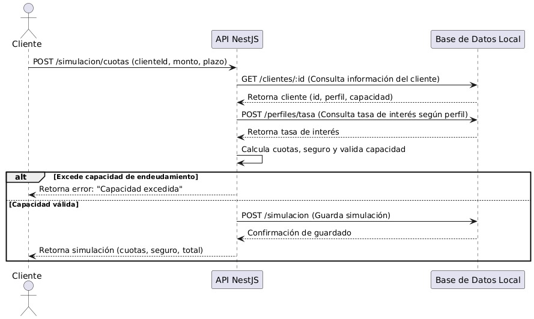
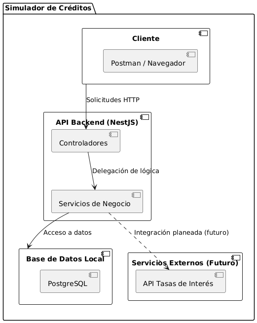
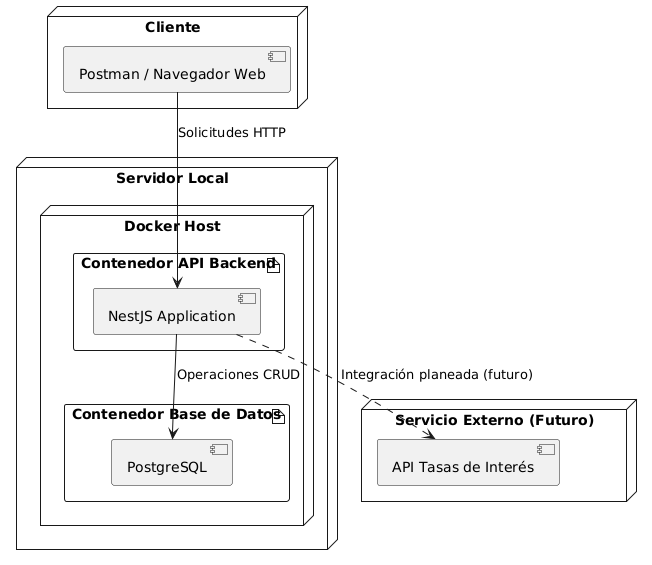
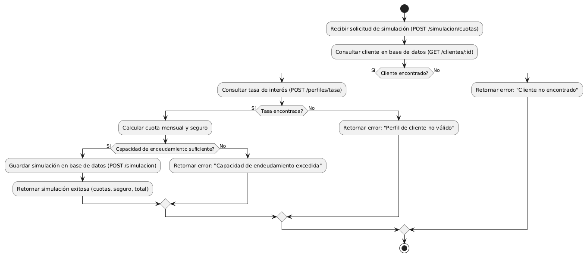

# Simulador de Créditos

Este proyecto es una implementación de una API de simulación de créditos desarrollada con **NestJS**. Permite calcular cuotas de crédito para un cliente en función de su perfil crediticio, monto solicitado, plazo y capacidad de endeudamiento.

## Características

1. **Consulta de ofertas**:
   - Asociación de ofertas a un cliente.
   - Identificación del perfil crediticio (AAA, BAA, AA).
   - Registro del estado de las ofertas (activo, inactivo, desembolsado).
   - Verificación de la capacidad de endeudamiento del cliente.

2. **Simulación de créditos**:
   - Periodos disponibles: 12, 24, 36, 48, 60 meses.
   - Aplicación de tasas de interés según el perfil crediticio.
   - Cálculo de una cuota de seguro basada en la edad del cliente:
     - 19-30 años: 3% de la cuota.
     - 31-60 años: 4% de la cuota.
     - 61-70 años: 5% de la cuota.
   - Exclusión de periodos que excedan la capacidad de endeudamiento del cliente.

3. **Cumplimiento de principios de desarrollo**:
   - Arquitectura basada en principios **SOLID**.
   - Pruebas unitarias para los servicios desarrollados.
   - Contenedores Docker para despliegue.

## Tecnologías utilizadas

- **NestJS**: Framework backend basado en Node.js.
- **TypeScript**: Lenguaje de programación principal del proyecto.
- **Docker**: Para la creación y despliegue de contenedores.
- **Jest**: Framework para pruebas unitarias.

## Instalación y configuración

### Prerrequisitos

- **Node.js** (v20 o superior)
- **Docker**
- **Git**

### Pasos para ejecutar el proyecto

1. Clona el repositorio:

   ```bash
   git clone https://github.com/jhonnatanmayorga/simulador-creditos.git
   cd simulador-creditos
   ```

2. Instala las dependencias:

   ```bash
   npm install
   ```

3. Ejecuta el proyecto en modo desarrollo:

   ```bash
   npm run start:dev
   ```

4. Para construir y ejecutar con Docker:

   - Construye la imagen Docker:

     ```bash
     docker build -t simulador-creditos .
     ```

   - Ejecuta el contenedor:
    - Puero 3000
     ```bash
     docker run -p 3000:3000 simulador-creditos
     ```
    - Otro Puerto ejemplo: 8089
    ```bash
     docker run -p 8089:3000 simulador-creditos
     ```

5. Accede a la API en: `http://localhost:3000`

## Endpoints disponibles

### **1. Consultar Tasa**
- **POST** `/perfiles/tasa`

  **Cuerpo de la petición:**
  ```json
  {
    "perfil": "AA",
    "monto": 20000
  }
  ```

  **Respuesta de ejemplo:**
  ```json
  {
    "success": true,
    "data": {
        "tasa": 24.95
    },
    "message": "Operación realizada con éxito",
    "error": null
  }
  ```

### **2. Consultar Cliente**
- **GET** `/clientes/:id`

  **Respuesta de ejemplo:**
  ```json
  {
    "success": true,
    "data": {
        "id": "999",
        "nombre": "Cliente 999",
        "edad": 25,
        "perfil": "BAA",
        "capacidadEndeudamiento": 2000000
    },
    "message": "Operación realizada con éxito",
    "error": null
  }
  ```

### **3. Consultar Ofertas**
- **GET** `/ofertas?clienteId=1`

  **Respuesta de ejemplo:**
  ```json
  {
    "success": true,
    "data": {
        "cliente": {
            "id": "1",
            "nombre": "Cliente 1",
            "perfil": "AAA",
            "capacidadEndeudamiento": 200000
        },
        "ofertas": [
            {
                "id": "1",
                "clienteId": "1",
                "monto": 7847500,
                "tasa": 20.1,
                "plazo": 24,
                "estado": "activo",
                "excedeCapacidad": true
            },
            {
                "id": "2",
                "clienteId": "1",
                "monto": 11442000,
                "tasa": 20.1,
                "plazo": 36,
                "estado": "activo",
                "excedeCapacidad": true
            }
        ]
    },
    "message": "Operación realizada con éxito",
    "error": null
  }
  ```

### **4. Generar Simulación**
- **POST** `/simulacion/cuotas`

  **Cuerpo de la petición:**
  ```json
  {
    "clienteId": "1",
    "monto": 1000000,
    "plazo": 24
  }
  ```

  **Respuesta de ejemplo:**
  ```json
  {
    "success": true,
    "data": {
        "cliente": {
            "id": "1",
            "nombre": "Cliente 1",
            "perfil": "AAA"
        },
        "simulacion": {
            "plazo": 24,
            "tasa": 23.45,
            "cuotaMensual": 51510,
            "seguro": 1545,
            "total": 53055
        }
    },
    "message": "Operación realizada con éxito",
    "error": null
  }
  ```

### **5. Generar Oferta**
- **POST** `/ofertas`

  **Cuerpo de la petición:**
  ```json
  {
    "clienteId": "1",
    "monto": 10000000,
    "plazo": 24,
    "tasa": 18.5
  }
  ```

  **Respuesta de ejemplo:**
  ```json
  {
    "success": true,
    "data": {
        "id": "3",
        "clienteId": "1",
        "monto": 10000000,
        "tasa": 18.5,
        "plazo": 24,
        "estado": "activo"
    },
    "message": "Oferta generada con éxito",
    "error": null
  }
  ```


## Pruebas

Ejecuta las pruebas unitarias con:

```bash
npm run test
```

## Diagrama de Secuencia



## Diagrama de Componentes



## Diagrama de Despliegue



## Diagrama de Actividades


